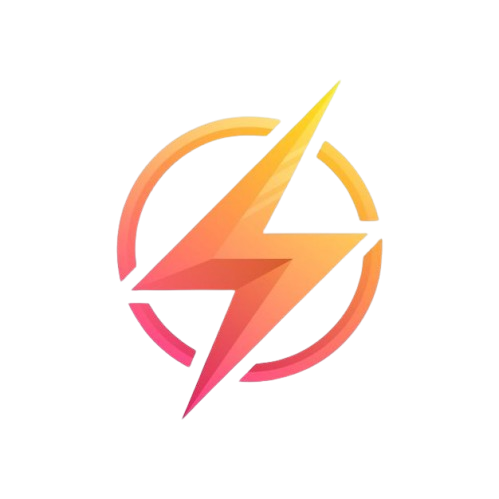

  

<h1 align="center">ThunderPass ⚡</h1>

  <em>The modern StreetPass experience — for Android.</em>

  
  
  
  
  
  

---

> **Remember StreetPass?** You'd wander around with your Nintendo 3DS and later find it had silently swapped little profile cards with everyone you'd walked past. ✨
>
> **ThunderPass brings that magic to Android.** Walk around — whenever another ThunderPasser is nearby your phones quietly spark, swapping profile cards and building your collection. No accounts, no fuss, no internet required.

---

## Screenshots

<table>
  <tr>
    <td align="center"> <b>Start Screen</b></td>
    <td align="center"> <b>My Profile</b></td>
  </tr>
  <tr>
    <td align="center"> <b>My Sparky</b></td>
    <td align="center"> <b>Friend Exchanged with Privacy Mode</b></td>
  </tr>
</table>

---

## Is this app AI Developed?

Short answer, Yes.
Long answer, Thanks for asking it, yes it was, this app was made with AI to make it fast, the project is open source, so if you want to come and develop it with me as a side hobby project join me!
It is on alpha/beta phase yet and as a proof of concept it was made using it. I will keep using it but I will make sure to use well and keeping the security, visibility, accountability, and proactive improvement. 
I am open to explain, talk and share about the project. 
Most important of all, thanks for believing on me to make this come to life to our gaming community!❤️⚡

---

## What happens when you Spark? ⚡

When two ThunderPassers cross paths:

1. Your phones notice each other over Bluetooth — completely in the background.
2. They silently swap **profile cards** — your name, avatar, and personal greeting.
3. A double-pulse vibration says *The Spark happened*.
4. The encounter is saved in your **Passes** list.
5. You earn **100 Volts** — the energy currency of ThunderPass.

That's it. No tapping required. Just live your life and let ThunderPass do its thing.

---

## Features

### ⚡ Sparks & Encounters
- Automatic **Bluetooth BLE** detection — runs quietly in the background as a foreground service.
- **Privacy first**: your real ID is never broadcast. A rotating anonymous ID changes every 60 minutes.
- Smart dedup — the same person won't flood your list (24-hour cooldown per identity, profile card always updated with the latest data).
- Instant **push notification** the moment a new ThunderPasser is detected nearby.
- Full **encounter history** with timestamps, signal strength, and the peer's profile card.

### 🧑‍🎨 Your Profile (Sparky)
- Pick a display name, write a personal greeting (up to 60 characters), and customize your **Sparky** avatar with per-feature sliders.
- Your profile is what others see when you Spark — make it yours.
  - **Privacy mode**: flip the toggle and your identity stays hidden — nearby devices still see your name, avatar, greeting, and stats, but nothing that could link you across encounters (no account ID, no RetroAchievements username, no device fingerprint).
- Connect your **RetroAchievements** username to show your gaming stats on your Spark card.

### 🏆 Badges
Badges are earned by living your ThunderPass life — sparking new people, playing retro games, hitting streaks, and more. Five tiers:

| Tier | Colour | Vibe |
|---|---|---|
| Not Achieved | Dark grey | Keep going! |
| Common | Blue | Nice start ⚡ |
| Uncommon | Purple | Getting rare! |
| Rare | Orange | Wow, impressive |
| Legendary | Gold | You're a legend 🌩️ |

Each badge features a **thunder bolt** — because of course it does.

### 🔋 Volts — Energy System
Every unique Spark earns you **100 Volts**. Spend Volts in the Shop to unlock profile effects:
- **CRT Scanlines** — retro TV vibes on your profile card.
- **Pixelated Aura** — 8-bit glow around your avatar.
- **Thunder Trail** — leave a lightning trail wherever you go.

### 🕹️ RetroAchievements Integration
Connect your [RetroAchievements](https://retroachievements.org) username and unlock extra sparks:
- See a peer's **rank, points, and recently mastered games** on their encounter card.
- Earn special badges for legendary encounters.

### ⚙️ Settings
- **Scanning Mode**: choose Battery Saver, Balanced, or Always On — tailored BLE scan intensity to match your lifestyle and battery.
- **Vibration**: enable or disable haptic feedback on encounters.
- **LED Flash**: three yellow blinks on supported devices when a new Spark is detected (configurable in Permissions).
- **Safe Zones**: pause scanning automatically when you're home.
- **Privacy Mode**, Background Music, Keep-Screen-On, and OTA update checks.

### ☁️ Anonymous Cloud Identity
ThunderPass signs you in **silently and anonymously** on first launch — no email, no password, no account creation. This creates a cloud identity used only for encounter verification and deduplication. Your profile (name, avatar, greeting, Volts) is backed up and restored automatically.

> **What if I delete the app?** Your anonymous identity is tied to this install. Your cloud profile stays on the server, but it cannot be auto-linked after reinstall. Signing in with a named account (email OTP) lets you recover everything. Cloud backup of Spark history is planned for a future version.

---

## Getting Started

### Download

Grab the latest debug APK from the [GitHub Releases](https://github.com/guilhermelimait/ThunderPass/releases) page and sideload it onto your Android 12+ device.

### Build from source

1. **Clone** the repo and open it in **Android Studio Hedgehog** or later.
2. **Build & run** on any Android 12+ device with Bluetooth LE support (`Run › Run 'app'`).
3. Set up your profile, hit the **ThunderPass toggle**, and go outside! 🚶

> **Tip:** ThunderPass works best running in the background. Grant all permissions it asks for at first launch and add it to your battery optimisation whitelist when prompted.

---

## Permissions Used

ThunderPass asks only for what it needs:

| Permission | Why |
|---|---|
| `BLUETOOTH_SCAN` | Find nearby ThunderPassers |
| `BLUETOOTH_ADVERTISE` | Let others find you |
| `BLUETOOTH_CONNECT` | Exchange profile cards |
| `POST_NOTIFICATIONS` | Alert you when someone Sparks nearby |
| `VIBRATE` | Double-pulse feedback on encounters |

---

## Supported Devices

ThunderPass runs on any **Android 12+** phone or handheld with Bluetooth LE. It's been tested and designed with handheld gaming devices in mind:

- **AYN Thor** series
- **Retroid Pocket** series
- **Odin** series
- Any Android phone 📱

---

## Roadmap

See [`ROADMAP.md`](ROADMAP.md) for the full plan. Highlights coming next:

- 🎨 Full Profile screen overhaul — two-column layout, RetroAchievements gallery, auto-save
- 🏷️ Badge updates — Alfa Tester, Beta Tester, Node Zero badges
- 🌍 Power Surge Events — location-based 2× Volt multipliers
- 🔌 Public payload SDK — let other apps plug into ThunderPass

---

## Contributing

Contributions are very welcome! Whether it's a bug report, a feature suggestion, a screenshot for the docs, or a pull request:

1. **Fork** the repo.
2. Create a branch: `git checkout -b feature/your-feature`.
3. Commit your changes and open a **Pull Request**.

Found a bug? [Open an issue](https://github.com/guilhermelimait/ThunderPass/issues) — all feedback is welcome and read by the developer personally.

---

## Support the project ☕

ThunderPass is a labour of love, built entirely by one person in their spare time. If it puts a smile on your face, a coffee goes a long way:

  

Come hang out on **[Discord](https://discord.gg/jVxQnp8Fy)** — share screenshots, report issues, or just say hi. The community is small but friendly. ⚡

---

## Thanks

A huge thank you to everyone who has tried ThunderPass, reported bugs, sent feedback, and kept the spirit of StreetPass alive. You're the reason this exists.

Special thanks to:
- The **RetroAchievements** community for keeping retro gaming alive.
- The **AYN**, **Retroid**, and **Odin** communities for being the perfect audience for a project like this.
- Everyone who buys a coffee — it genuinely makes a difference.
- **You**, for reading this far. Go Spark someone! ⚡

