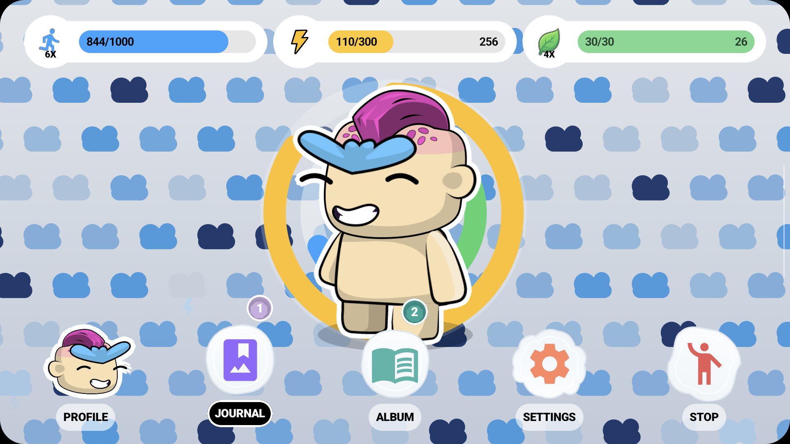

# ThunderPass

There was something about carrying a 3DS in your pocket and suddenly seeing that little blue light blink on. Someone nearby had one too. You did not know who they were, you never spoke to them, maybe you only crossed paths for a few seconds on a train or in a shopping centre — and yet something happened. A quiet, happy little exchange. Two strangers who shared the same thing, briefly acknowledging each other through a device. It felt like a secret handshake the rest of the world was not part of. I loved that feeling more than almost any other thing a game ever gave me, and when that era ended I kept thinking about how nothing quite replaced it. ThunderPass is my attempt to bring it back — for Android handhelds, offline, no accounts, no servers, just the small joy of being near someone who is playing the same game as you.

ThunderPass is an AI-assisted, offline-first Android handheld game built around that feeling. It uses no cloud sync, no accounts, and no web tracking. Everything stays local to your device unless you intentionally meet another ThunderPass player nearby.

**Your handheld. Your avatar. Your world.**

ThunderPass turns your daily steps and the people around you into a game. Walk to earn Leafs and Volts, build your character, collect badges, and exchange profile cards with other players when your devices get close.

## Install

If you want to keep ThunderPass updated automatically, install it with Obtainium: [https://obtainium.imranr.dev/](https://obtainium.imranr.dev/)

---

## What it does right now

**Walk and earn.**
Every step you take earns Volts. Walk more, earn more. A stacking streak multiplier boosts step-based Volt rewards through the 7-day cycle, and completion still grants a streak bonus.

**Your Thiiing.**
You have a little character called a Thiiing. It lives on your home screen and grows with you. Give it a face, hairstyle, accessories, and outfits. Every piece you unlock or buy becomes part of who your Thiiing is.

**Customise your avatar and background.**
Spend Volts on avatar assets and use Leafs for background visuals on your Passport card. The more you play, the more you can unlock. No real money required.

**New assets coming soon.**
More avatar assets and background visuals are being prepared and will be released in upcoming app updates.

**Badges and milestones.**
The game tracks what you do and rewards it. Hit a step milestone, keep a streak, pull off a rare encounter — you get a badge. They stack up in your album and show off your history.

**Encounter other players.**
When two ThunderPass devices come within range of each other, they exchange only the necessary profile data over Bluetooth. It is meant to feel like a small blue-light moment: happy, welcoming, and engaging when someone else is nearby with the same device, with LED indicators also used to show that someone passed by. No full encounter history is shared, and everything stays offline.

**Mini-games and events.**
Short skill games that run entirely on your device. They appear daily and let you earn up to 30 Leafs per day automatically.

**Your Passport.**
Every player has a Passport — a profile card with your Thiiing, your stats, and your badges. It is what other players receive when they meet you.

**Home screen widgets.**
ThunderPass includes compact profile widgets. Add it to your homescreen and you will be able to follow up your steps, volts, leafs streak days and badges achieved so far.

## Permissions

ThunderPass asks for a small set of permissions so the game can run locally on your device.

- Bluetooth permissions are used for nearby player encounters.
- Activity recognition is used to read your step counter.
- Notifications are used for the persistent BLE service and encounter feedback.
- Vibration is used for haptics when the app triggers a system event.
- Internet is used only for optional avatar image loading and is not used for cloud sync, accounts, or web tracking.

---

## Devices

ThunderPass runs in landscape-only mode and is designed for gaming handhelds.
Currently developed and tested on:

- Retroid Pocket 4 Pro
- AYN Thor

It will run on any Android device (API 33+) in landscape orientation, but the layout and controls are optimised for handheld gaming form factors.
